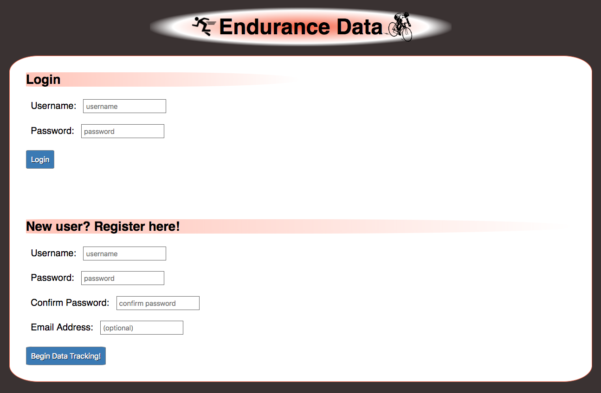
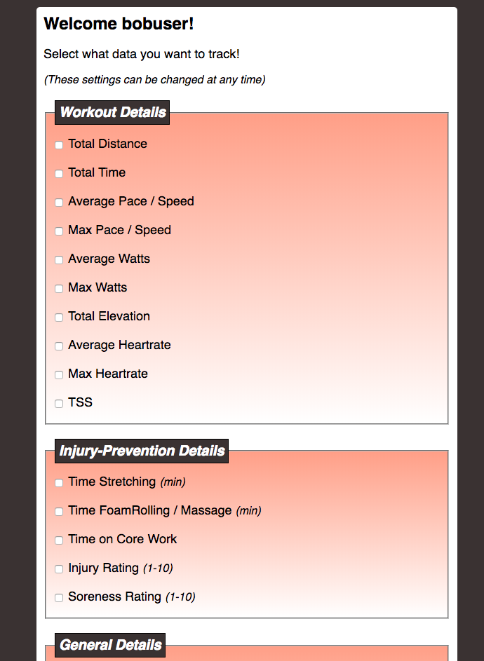
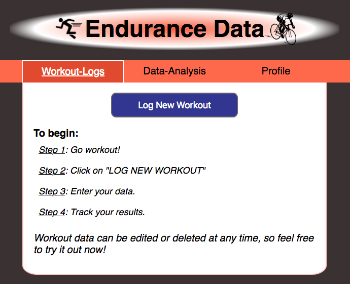
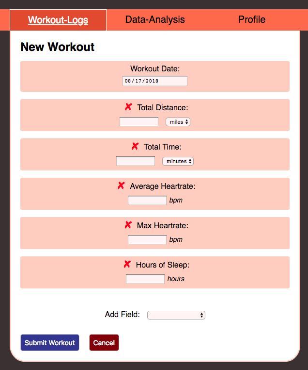
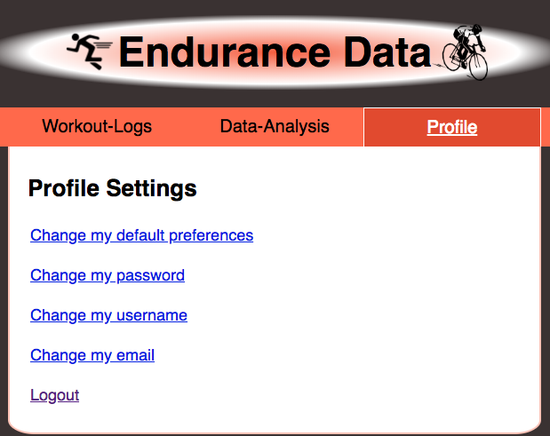
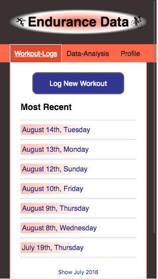
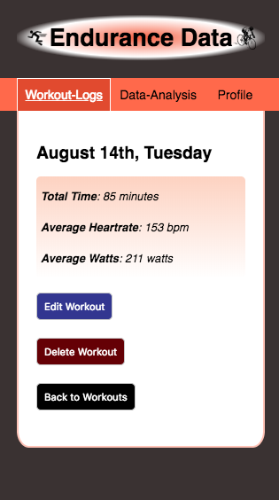

# Endurance Data
  *The newest fitness tracking tool*


## Deployment:

  App is deployed at: https://endurancedata.netlify.com/ 


## Description:

  Endurance Data is a cloud-based workout log.  Endurance data is designed for use by endurance athletes (runners and cyclists).  This app has an easy-to-use interface, and is capable of tracking all of an athlete's training data.  Users enter data from their workouts manually, and Endurance Data will store and display this data.

  Endurance Data is unique to each user because each user can choose what data he/she wants to log.  For example, a beginning runner might only want to track their total mileage for each day.  This user will receive a user-interface that is simplified to only include this input field.  However, a professional cyclist might want to keep track of Total Time, Average Heartrate, Max Heartrate, Average Watts, Max Watts, Hours of Sleep, Soreness Rating, Time Spent Stretching, etc. for each day.  This user would have an interface where each of these input fields is brought up by default.  Endurance Data stores each workout in a database, and allows users to recall their workouts.

  ...*Feature Coming Soon*...Endurance data will allow a user to perform an analysis of their data.  For example, a user might selete to see *"Miles per day over the past week"*, and Endurance Data would display *"You averaged 5.2 miles per day over the past week"*.  This feature is still in production, and the app works perfectly fine without it for now.


## Screenshots:


#### Initial Login Page:





#### Choosing Default Preferences:





#### Landing Screen for first time users:





#### Adding Form for entering a new workout:





#### Main page for changing user settings:





#### Mobile View:


 


## Description of Tech Stack:

   Endurance Data is created using React for the front-end and Node.js for the back-end.

   *Front-end:* The clientside of this app is created using React.  Redux is used to manage the high-level state of the app.  React Stateful components are used to manage the state that is specific to each component.  `react-router-dom` is used to route users to different components based on their url path.  `moment.js` is used to format dates and perform calculations with the dates.  `enzyme` is used to test each component.  As of now, each component is tested, but many tests are just smoke tests.  API calls are made using Javascript's `fetch` method.  The server-side is located in a separate repo.

   *Back-end:* Here is the [server-side repo](https://github.com/thinkful-ei22/morgan-fullStack-server.git) for this application.  The server-side is written in `Node.js` and uses `express` to route incoming requests.  The app uses a MongoDB to store the data, which is hosted by mLab.com.  The server-side uses `bcryptjs` to encrypt user passwords for maximum security.  The server-side also uses the `jsonwebtoken` library to issue webtokens to users, which is stored in local storage on the front-end.  The server-side uses `mongoose` as the query library when making calls to the database.  Server-side tests are written using the `mocha` and `chai` libraries, with `chai-http` to simulate requests to the server.  The back-end is deployed live using [heroku](https://endurance-data-server.herokuapp.com/).

## Description of Key Code Snippets:

The overarching parent component is `<App />`.  When this component renders, it will check local storage for a webtoken, and immediately try to fetch user data.  If data comes back, then the `<Dashboard />` is displayed.  If no data comes back, or if there is no token in local storage, the `<LoginScreen />` is displayed:
  ```
  componentWillMount(){
    if(localStorage.getItem('authToken') ) {
      this.props.dispatch(getWorkouts());
    }
  }
  ```


There are 4 Main App Components: `<Login Screen />`, `<Workouts />`, `<Data-Analysis />`, and `<Profile />`...

- *Login Screen*: The l`<LoginScreen />` component lives in the `/src/components/loginScreen.js` path.  It renders when there is no current user in the Redux state.  It's main functionality is to allow users to receive a webtoken so that they can access the `<Dashboard />`


- *Workouts*: The `<Workouts />` component lives in the `/src/components/workouts-list/workouts.js` path.  It corresponds to the url ".../workouts".  This is the main purpose of the entire app.  This component is stateful, and based on the state, it will render other components related to the workout log functionality.  The `<Workouts />` state looks like this:     
```
this.state = {
      addingWorkout: false,
      currentWorkout: null,
      editingWorkout: false,
      viewingWorkout: false,
      deletingWorkout: false,
      formOptions: []
    }
```
    
    
- *Data-Analysis*: This feature is not yet in production.

- *Profile*: The `<Profile />` component lives in the path `/src/componets/user-preferences/profile.js`.  It corresponse to the ".../profile" url.  It's main purpose is to render a page for users to change their personal settings.  This page uses `<Link />` components to re-route users to the appropriate component for changing their settings.  Here is an example of how this component links to other components with the path ".../profile/\[other-component]"  :

```
<div className='link-container'>
  <Link to='/profile/username'>
    <span>Change my username</span>
  </Link>
</div>
```
    

